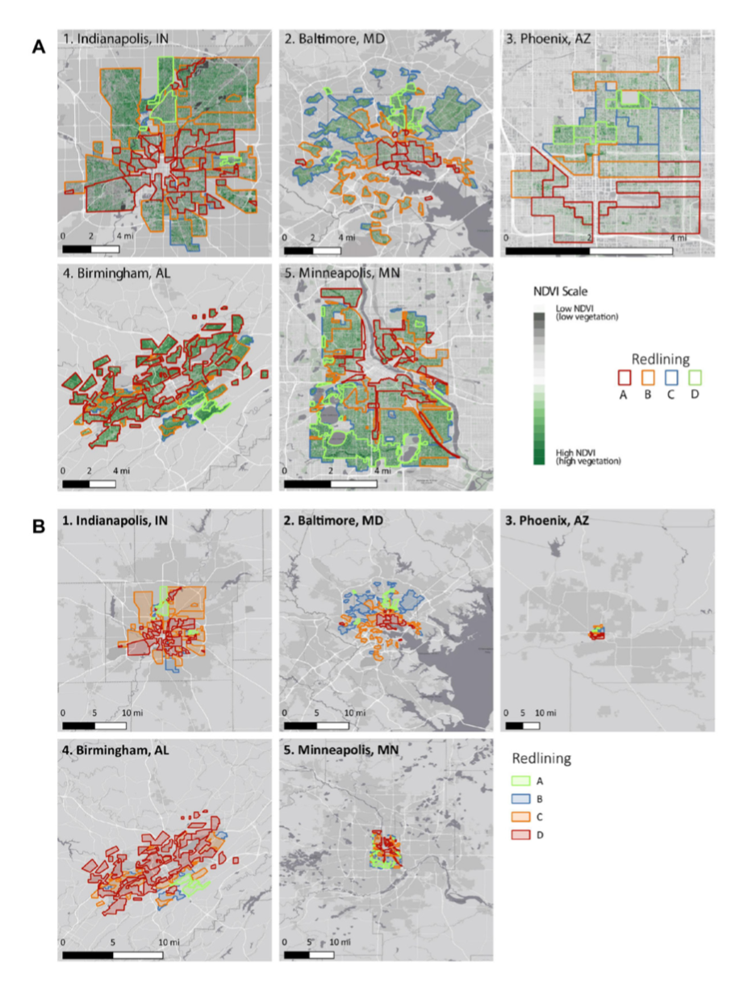

```{r setup, include=FALSE}
knitr::opts_chunk$set(messages = FALSE, cache = FALSE)

# remotes::install_deps()
library(tmap)      #interactive maps, raster + vector layers
library(terra)       # Successor to the raster library
library(tidyverse)   # our old friend
library(sf)          # to work with simple features (vector) data
```

## Learning objectives
This module provides an introduction to the fundamentals of working with spatial vector and raster data in R while empirically exploring why systematic and structural racism is interwined with urban ecological processes. This module uses the Simple Features Access standard (ISO 19125) and tidyverse-style workflow using the sf package and emerging ecosystem of r-spatial tools.

# Exercise 
In August 2020, [Christopher Schell](http://directory.tacoma.uw.edu/employee/cjschell) and collegues published a review in *Science* on ['The ecological and evolutionary consequences of systemic racism in urban environments'](https://science.sciencemag.org/content/early/2020/08/12/science.aay4497) (DOI: 10.1126/science.aay4497), showing how systematic racism and classism  has significant impacts on ecological and evolutionary processes within urban environments. Here we explore a subset of the data used to support these findings in this review and the broader literature.

The [press release](https://www.washington.edu/news/2020/08/13/systemic-racism-has-consequences-for-all-life-in-cities/) on the paper is worth a read:

> “Racism is destroying our planet, and how we treat each other is essentially structural violence against our natural world,” said lead author Christopher Schell, an assistant professor of urban ecology at the University of Washington Tacoma. “Rather than just changing the conversation about how we treat each other, this paper will hopefully change the conversation about how we treat the natural world.”

In the paper, Schell writes: 

 > "In multiple cases, neighborhood racial composition can be a stronger predictor of urban socio-ecological patterns than wealth."

We are going to explore one metric for how structural racism and classism underpin landscape heterogeneity in cities.

**Figure 2** in the Schell paper shows how NDVI (Normalized Difference Vegetation Index) tracks historical redlining.


We are going to recreate these city maps, and plot the distributions and mean vegetation patterns across cities to explore the structural inequality and racism that Schell et al highlight in their paper.


To do this we are going to use the following spatial data:  

**1.Mapping Inequality:** (vector data)  
Please take the time to read the introduction to this dataset [here](https://dsl.richmond.edu/panorama/redlining/#loc=3/41.245/-105.469&text=intro)


```{r}
oaklandzip<-"https://dsl.richmond.edu/panorama/redlining/static/downloads/shapefiles/CAOakland1937.zip"

san_fran_zip <- "https://dsl.richmond.edu/panorama/redlining/static/downloads/shapefiles/CASanFrancisco1937.zip"
san_josezip<- "https://dsl.richmond.edu/panorama/redlining/static/downloads/shapefiles/CASanJose1937.zip"

oaklandurl<-paste0("/vsizip/vsicurl/", oaklandzip)
san_franurl <- paste0("/vsizip/vsicurl/", san_fran_zip)
san_joseurl<-paste0("/vsizip/vsicurl/", san_josezip)
sf <- read_sf(san_franurl)
sf2<-read_sf(oaklandurl)
sf3<- read_sf(san_joseurl)

sf
sf2
sf3
```
```{r}
tmap_mode("view") #hashtag this later when knitting 
tm_shape(sf) + tm_polygons("holc_grade", alpha=0.5)
tm_shape(sf2) + tm_polygons("holc_grade", alpha=0.5)
tm_shape(sf3)+ tm_polygons("holc_grade", alpha=0.5)
```
```{r}
#install.packages(c("gdalcubes", "rstac"))
library(tidyverse)
library(rstac)
library(gdalcubes)
library(stars)
library(tmap)
gdalcubes::gdalcubes_options(parallel = TRUE)
```

```{r}
## STAC Search over 400 million assets.
#use stt_bbox to find coordinates for city 
box <- c(xmin=-122.51006, ymin=37.70801, xmax=-122.36268, ymax=37.80668) 
start_date <- "2022-06-01"
end_date <- "2022-08-01"
items <- 
  stac("https://earth-search.aws.element84.com/v0/") |>
  stac_search(collections = "sentinel-s2-l2a-cogs",
              bbox = box,
              datetime = paste(start_date, end_date, sep="/"),
              limit = 100) |>
  post_request() 
```

```{r}
names(items$features[[1]])
```
```{r}
col <-
  stac_image_collection(items$features,
                        asset_names = c("B02", "B03", "B04","B08", "SCL"),
                        property_filter = \(x) {x[["eo:cloud_cover"]] < 20})#filter out images with more than 20 percent cloud cover
```

```{r}
cube <- cube_view(srs = "EPSG:4326",  
                  extent = list(t0 = start_date, t1 = "2022-08-31",
                                left = box[1], right = box[3],
                                top = box[4], bottom = box[2]),
                  nx = 1000, ny = 1000, dt = "P1M",
                  aggregation = "median", resampling = "average")
S2.mask <- image_mask("SCL", values=c(3,8,9)) # mask clouds and cloud shadows

ndvi <- 
  raster_cube(col, cube, mask = S2.mask) |>
  select_bands(c("B08", "B04")) |>
  apply_pixel("(B08-B04)/(B08+B04)", "NDVI") |>
  aggregate_time("P3M") |>
  st_as_stars()
```
```{r}

```

> "As you explore the materials Mapping Inequality, you will quickly encounter exactly that kind of language, descriptions of the "infiltration" of what were quite often described as "subversive," "undesirable," "inharmonious," or "lower grade" populations, for they are everywhere in the HOLC archive ....These grades were a tool for redlining: making it difficult or impossible for people in certain areas to access mortgage financing and thus become homeowners. Redlining directed both public and private capital to native-born white families and away from African American and immigrant families. As homeownership was arguably the most significant means of intergenerational wealth building in the United States in the twentieth century, these redlining practices from eight decades ago had long-term effects in creating wealth inequalities that we still see today. Mapping Inequality, we hope, will allow and encourage you to grapple with this history of government policies contributing to inequality."

**2.Normalized Difference Vegetation Index (NDVI)** (raster data)
NDVI is used as proxy measure of vegetation health, cover and phenology (life cycle stage) over large areas. It is calculated using multiple bands from satellite images.

#Calculate NDVI values for each city for different seasons to compare values for summer versus winter/spring

# Exercise 1
**Create a map which shows current (2019) mean NDVI across city redlining from the 1950s.**

```{r}
```

# Exercise 2
**Plot the average NDVI values in different neighborhoods as well as the distribution of pixel values across cities and neighborhoods. Show how the trends differ between cities.**


# Exercise 3: 
**Explain why considering systematic inequity and racism is important in the context of global change and developing solutions to the biodiversity crisis.**

