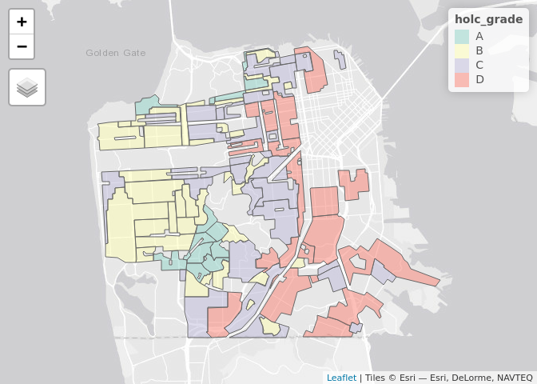
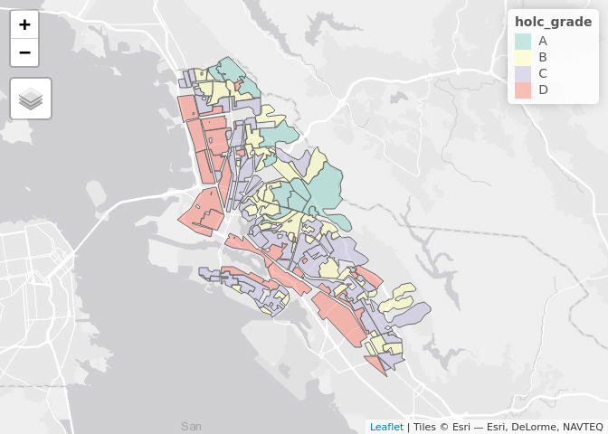
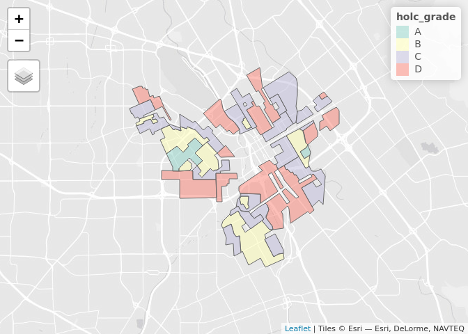

The ecological and evolutionary consequences of systemic racism
================
Millie Chapman (GSI)

## Learning objectives

This module provides an introduction to the fundamentals of working with
spatial vector and raster data in R while empirically exploring why
systematic and structural racism is interwined with urban ecological
processes. This module uses the Simple Features Access standard (ISO
19125) and tidyverse-style workflow using the sf package and emerging
ecosystem of r-spatial tools.

# Exercise

In August 2020, [Christopher
Schell](http://directory.tacoma.uw.edu/employee/cjschell) and collegues
published a review in *Science* on [‘The ecological and evolutionary
consequences of systemic racism in urban
environments’](https://science.sciencemag.org/content/early/2020/08/12/science.aay4497)
(DOI: 10.1126/science.aay4497), showing how systematic racism and
classism has significant impacts on ecological and evolutionary
processes within urban environments. Here we explore a subset of the
data used to support these findings in this review and the broader
literature.

The [press
release](https://www.washington.edu/news/2020/08/13/systemic-racism-has-consequences-for-all-life-in-cities/)
on the paper is worth a read:

> “Racism is destroying our planet, and how we treat each other is
> essentially structural violence against our natural world,” said lead
> author Christopher Schell, an assistant professor of urban ecology at
> the University of Washington Tacoma. “Rather than just changing the
> conversation about how we treat each other, this paper will hopefully
> change the conversation about how we treat the natural world.”

In the paper, Schell writes:

> “In multiple cases, neighborhood racial composition can be a stronger
> predictor of urban socio-ecological patterns than wealth.”

We are going to explore one metric for how structural racism and
classism underpin landscape heterogeneity in cities.

**Figure 2** in the Schell paper shows how NDVI (Normalized Difference
Vegetation Index) tracks historical redlining. 

We are going to recreate these city maps, and plot the distributions and
mean vegetation patterns across cities to explore the structural
inequality and racism that Schell et al highlight in their paper.

To do this we are going to use the following spatial data:

**1.Mapping Inequality:** (vector data)  
Please take the time to read the introduction to this dataset
[here](https://dsl.richmond.edu/panorama/redlining/#loc=3/41.245/-105.469&text=intro)

``` r
oaklandzip<-"https://dsl.richmond.edu/panorama/redlining/static/downloads/shapefiles/CAOakland1937.zip"

san_fran_zip <- "https://dsl.richmond.edu/panorama/redlining/static/downloads/shapefiles/CASanFrancisco1937.zip"
san_josezip<- "https://dsl.richmond.edu/panorama/redlining/static/downloads/shapefiles/CASanJose1937.zip"

oaklandurl<-paste0("/vsizip/vsicurl/", oaklandzip)
san_franurl <- paste0("/vsizip/vsicurl/", san_fran_zip)
san_joseurl<-paste0("/vsizip/vsicurl/", san_josezip)
sf <- read_sf(san_franurl)
sf2<-read_sf(oaklandurl)
sf3<- read_sf(san_joseurl)

sf
```

    ## # A tibble: 97 × 4
    ##    name  holc_id holc_grade                                             geometry
    ##    <chr> <chr>   <chr>                                        <MULTIPOLYGON [°]>
    ##  1 <NA>  A1      A          (((-122.4755 37.78687, -122.4755 37.78625, -122.476…
    ##  2 <NA>  A10     A          (((-122.4609 37.73566, -122.461 37.73572, -122.4613…
    ##  3 <NA>  A11     A          (((-122.4562 37.74046, -122.4566 37.74032, -122.456…
    ##  4 <NA>  A12     A          (((-122.4715 37.73326, -122.4665 37.73307, -122.465…
    ##  5 <NA>  A13     A          (((-122.461 37.73572, -122.4609 37.73566, -122.4605…
    ##  6 <NA>  A2      A          (((-122.4593 37.78795, -122.4598 37.78788, -122.459…
    ##  7 <NA>  A3      A          (((-122.4472 37.78954, -122.4485 37.78935, -122.454…
    ##  8 <NA>  A4      A          (((-122.446 37.80388, -122.4458 37.80235, -122.4456…
    ##  9 <NA>  A5      A          (((-122.4463 37.79187, -122.447 37.7966, -122.4463 …
    ## 10 <NA>  A6      A          (((-122.4731 37.7346, -122.4724 37.73464, -122.4723…
    ## # ℹ 87 more rows

``` r
sf2
```

    ## # A tibble: 119 × 4
    ##    name  holc_id holc_grade                                             geometry
    ##    <chr> <chr>   <chr>                                        <MULTIPOLYGON [°]>
    ##  1 <NA>  A       A          (((-122.2025 37.81099, -122.2023 37.81108, -122.201…
    ##  2 <NA>  A1      A          (((-122.2632 37.90039, -122.2618 37.89921, -122.261…
    ##  3 <NA>  A10     A          (((-122.234 37.80671, -122.2344 37.80611, -122.2344…
    ##  4 <NA>  A11     A          (((-122.2025 37.81099, -122.2034 37.8113, -122.2038…
    ##  5 <NA>  A2      A          (((-122.2785 37.8971, -122.2785 37.89687, -122.2786…
    ##  6 <NA>  A3      A          (((-122.2631 37.88555, -122.2628 37.88617, -122.262…
    ##  7 <NA>  A4      A          (((-122.2421 37.85182, -122.2471 37.8512, -122.2472…
    ##  8 <NA>  A5      A          (((-122.2381 37.84149, -122.2389 37.84128, -122.239…
    ##  9 <NA>  A6      A          (((-122.2156 37.83193, -122.2142 37.83047, -122.213…
    ## 10 <NA>  A7      A          (((-122.2246 37.83047, -122.221 37.82546, -122.2241…
    ## # ℹ 109 more rows

``` r
sf3
```

    ## # A tibble: 37 × 4
    ##    name  holc_id holc_grade                                             geometry
    ##    <chr> <chr>   <chr>                                        <MULTIPOLYGON [°]>
    ##  1 <NA>  A1      A          (((-121.9205 37.33682, -121.9241 37.33399, -121.920…
    ##  2 <NA>  A2      A          (((-121.8674 37.33292, -121.8703 37.33155, -121.872…
    ##  3 <NA>  B1      B          (((-121.9518 37.3473, -121.9493 37.34813, -121.949 …
    ##  4 <NA>  B2      B          (((-121.936 37.34388, -121.9347 37.34296, -121.9347…
    ##  5 <NA>  B3      B          (((-121.9271 37.32693, -121.932 37.32683, -121.9321…
    ##  6 <NA>  B4      B          (((-121.8963 37.34395, -121.8988 37.34311, -121.901…
    ##  7 <NA>  B5      B          (((-121.8679 37.3286, -121.8695 37.32788, -121.8729…
    ##  8 <NA>  B6      B          (((-121.9015 37.31701, -121.8978 37.31691, -121.898…
    ##  9 <NA>  B7      B          (((-121.8992 37.30631, -121.9013 37.30525, -121.899…
    ## 10 <NA>  C1      C          (((-121.9438 37.35085, -121.9497 37.34872, -121.949…
    ## # ℹ 27 more rows

``` r
tmap_mode("view") #hashtag this later when knitting 
```

    ## tmap mode set to interactive viewing

``` r
tm_shape(sf) + tm_polygons("holc_grade", alpha=0.5)
```

<!-- -->

``` r
tm_shape(sf2) + tm_polygons("holc_grade", alpha=0.5)
```

<!-- -->

``` r
tm_shape(sf3)+ tm_polygons("holc_grade", alpha=0.5)
```

<!-- -->

> “As you explore the materials Mapping Inequality, you will quickly
> encounter exactly that kind of language, descriptions of
> the”infiltration” of what were quite often described as “subversive,”
> “undesirable,” “inharmonious,” or “lower grade” populations, for they
> are everywhere in the HOLC archive ….These grades were a tool for
> redlining: making it difficult or impossible for people in certain
> areas to access mortgage financing and thus become homeowners.
> Redlining directed both public and private capital to native-born
> white families and away from African American and immigrant families.
> As homeownership was arguably the most significant means of
> intergenerational wealth building in the United States in the
> twentieth century, these redlining practices from eight decades ago
> had long-term effects in creating wealth inequalities that we still
> see today. Mapping Inequality, we hope, will allow and encourage you
> to grapple with this history of government policies contributing to
> inequality.”

**2.Normalized Difference Vegetation Index (NDVI)** (raster data) NDVI
is used as proxy measure of vegetation health, cover and phenology (life
cycle stage) over large areas. It is calculated using multiple bands
from satellite images.

# Exercise 1

**Create a map which shows current (2019) mean NDVI across city
redlining from the 1950s.**

# Exercise 2

**Plot the average NDVI values in different neighborhoods as well as the
distribution of pixel values across cities and neighborhoods. Show how
the trends differ between cities.**

# Exercise 3:

**Explain why considering systematic inequity and racism is important in
the context of global change and developing solutions to the
biodiversity crisis.**
